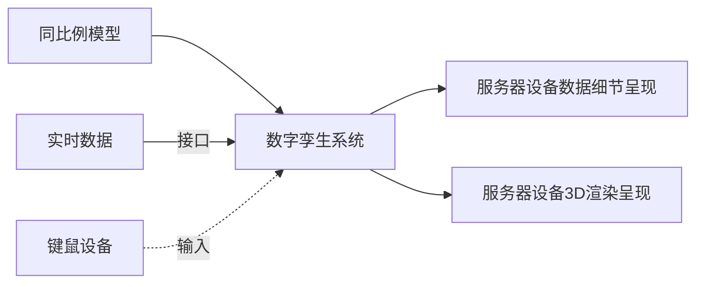

# 工作内容记录

*记录在山西广播电视台（SXRTS ）的工作内容  written by WenWeihang*

### 2022年7月 至 8月

首次来台实习，在网络部轮岗，跟随高健老师。巡检数据中心机房，视频制作机房，广播设备等。了解巡检流程和日常网络部的职责。

### 2022年8月 至 9月

在5G实验室轮岗，跟随刘鹏老师。对新兴OverIP的流媒体协议——NDI进行了调研和开发初探。翻译了部分NDI官方的相关视频，并完成了对NDI-5.0-SDK英文文档的核心翻译。同时对NDI源码在Linux系统上的编译和调试环境的搭建进行实践，并在内刊《三晋声屏》发文。

### 2022年9月 至 10月

在5G实验室轮岗，参与保障二十大安全播出。为二级平台大屏可视化——“党的二十大网络直播安全指挥中心”提供了技术支持。参加了台人事教育中心为期一周的培训，并提交了培训心得。

开始调研OverIP 的相关其他协议，诸如：SRT、SMPTE、WebRTC等，并总结调研内容至文字化。并锁定SRS作为实时推拉流服务器。

### 2022年10月 至 11月

对SRS其进行进一步的调研，实践搭建SRS服务器，并可以用其进行WebRTC和RTMP的推拉流。

跟随范老师走访台内各个办公部门，记录办公网的交换机位置和链接情况，绘制相关的网络拓扑图。

### 2023年1月至2月

利用Unity，完成虚拟党建VR系统，打包为H5发布，支持移动端，Windows等多平台。并可以通过不同平台进行适配界面。同时，其中的答题系统，可以与技术板块学习考核系统对接，进行沉浸有趣的答题体验。

### 2023年2月至3月

利用UIKit，完成三个APP的入口前端，同时界面上利用threeJS进行3D渲染台标。

尝试完成Unity中的FreeD协议插件，以打通直播XR工作流。

### 2023年3月至4月

去河南电视台交流学习

完成第一阶段FreeD工具的开发，加上了界面。

### 2023年5月至8月

参加山西广播电视台学习党的二十大精神知识竞赛

参加台内组织的“高举旗帜守初心 守正创新担使命”主题宣讲活动

协助刘老师调研并实践AIGC，以及深入数字虚拟主播技术。

在AIGC方面，搭建和引入Stable Diffuse，并应用其“文生图，图生图”等功能。

在数字虚拟主播方面，调研了多个开源模型 

- Wav2lip 及其二次开发结合GFPGAN的高清版本
- Video-Retalking
- Roop
- SadTalker
- DINet
- realesrgan 视频超分，对动画友好

其中，目前用到的是Wav2lip+Sadtalker+Opencv融合

阅读并学习了《机器学习实战》《生成式深度学习》《PyTorch生成对抗网编程》对相关的AI框架和技术有了全面的了解，对下一步的工作会有积极的促进作用。

### 2023年8月底

去北京参加BIRTV，调研AIGC相关集成技术和工具，并完成了AIGC技术调研的PPT和视频讲解。

### 2023年9月至10月

#### 文博会技术板块的视频展示

前期筹备策划工作，步骤依次为：

1. 与媒资部沟通洽谈，初步交换工作内容摘要。
2. 收集并调研关于“XXX随着时代变化”相关视频，选择出有代表性的三个优质视频。
3. 对上述优质视频进行细致分析，镜头语言、表现手法、视音结合等。
4. 提炼规划视频脚本。
5. 让领导审核并寻求核心和表达方向。
6. 修改视频脚本。
7. 向媒资部申请相关素材。
8. 制作AI数字人相关串场视频。
9. 合成最终视频。

十月份伊始，文博会任务取消了，仅完成到第3步。

#### 数字孪生项目

用于制播网机房的数字孪生展示。机房设备3D模型提供方为制作中心，机房设备数据提供方为融媒技术中心网络部。数字孪生项目制作为融媒技术中心5G实验室。

第一版制作内容，截至日期（2023年11月底前）：

两个服务器机柜（包含服务器），场景载入后，摄像机以第一人称视角面向机柜。玩家可以通关鼠标交互，环视镜头。但锁定移动。场景会以一定的刷新频率访问并获得服务器后台状态数据，并反馈在服务器外在表象上（例如：灯光闪烁和颜色）

当用户选择指定的服务器后，摄像机会移动至服务器一侧，弹出全息面板展示服务器细节数据。此时锁定摄像机镜头和移动。用户此时可以查看服务器内容。选择关闭面板后，摄像机后撤移动至上一个场景的初始状态。

异常处理，当后台数据访问失败或超时，应该给予显著提示，并告知用户，且用户操作锁定。

测试和修改BUG，截至日期（2023年12月中旬前）：

#### 与健康广播沟通洽谈虚拟数字人落地。

筹备技术板块技术交流务虚会。组织分享一波技术风向的变现和展望。技术团队组织结构的改革和创新等等。

#### 在线答题的游戏小游戏

类似于玩家在奔跑中选择题目的答案。可以尝试分为两步走：

- 单机登录网页或者下载APP后即可使用

- 多人联机后在线同时竞技

  

回答正确问题后，可以武装自己（特效什么的），比如都是走路，回答对就是自行车，摩托车，开汽车 等等~