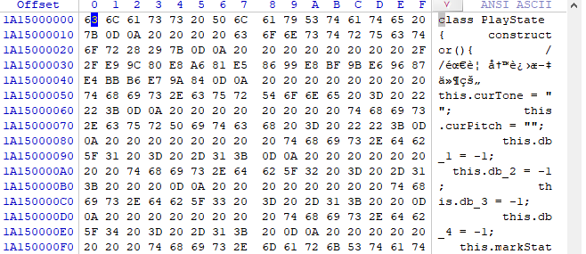

# Zero零字节文件硬核恢复

*written by Wen Weihang 2022-10-12*

### 飞来横祸

早起精神抖擞启动电脑，准备测试一下昨日的代码，竟然发现，代码内容不翼而飞！成为了0字节，打不开删不掉，非常可怕！


脑瓜子瞬间发懵，打开VSCode，发现并未启动自动保存，也没发现该文件的自动备份，顿时陷入了僵局。回忆起昨日，确实我有所保存，于是想到是否可以去查看磁盘的数据，一探究竟。

### 急中生智

恰巧，电脑中安装了**DiskGenius**，于是用DG打开U盘，找到那个代码文件ctr.js，可以看到虽然显示的文件大小为0，且无法预览，但是数据在磁盘内确实存在。


使用DG的文件恢复功能和文件复制功能，均无法将此文件恢复。因为文件恢复是用于已经删除且未被覆盖的文件，而文件复制功能使用后，复制出的**文件还是0字节，依然无法使用**：


最后，鉴于这个文件是JS文件属于文本文件，急中生智下，只能将数据从磁盘的RAW数据中拷贝出，并保存为JS格式的文件。这才应急的将文件恢复出来，其中的脚本内容是正确的，修改名称后即可使用。


### 抽丝剥茧

虽然已经将文件数据恢复，但是我不禁陷入沉思。为什么磁盘中数据存在，但是操作系统和这些软件却找不到数据呢？为什么会显示0字节，虽然打不开删不掉，但是文件修改时间等属性又是正确的呢？

带着诸多问号，搜到了一篇文章 [What Is a Zero Byte File](https://www.easytechjunkie.com/what-is-a-zero-byte-file.htm) ，文章中有一段写道：导致文件长度为零的其他原因包括磁盘上的物理错误(阻止写入数据)和损坏的文件分配表信息(留下并非真正文件的零长度文件)  

> 原文为：Other causes for a zero length file include physical errors on a disk that prevent data from being written and corrupted file allocation table information that leaves zero length artifacts that are not really files. 

我们猜测，极大可能是文件分配表 ( FAT ) 信息错了。FAT就好像是“书本的目录”，它可以告诉操作系统，当前文件夹下管理的文件属性，若需详细参看文件，则翻到具体的页去查看。我们顺藤摸瓜，利用软件去查看一下U盘的 FAT 信息是不是坏了。我们这次换一个便捷轻量的软件 **WinHex64** （查看磁盘数据需要用管理员权限打开）。

我们继续对 FAT 进行进一步调研。我们发现U盘的文件系统格式是exFAT，搜一搜发现不少干货，有论文《基于WinHex的exFAT文件系统结构研究》中对exFAT中的 DBR、FAT、簇位图、大写字符文件和用户数据区在WinHex中进行了简要的分析。与此同时，又有一篇文章[《exFAT文件系统分析》](https://blog.csdn.net/q1w21_2/article/details/79248095)细致的分析了exFAT文件系统结构，并对其中各个字段的定义进行了解释。

结合上述内容，发现病因可能出现在用户文件目录项出现了问题，通过治疗后，我们相信这个文件是可以在U盘上完美恢复的，是时候开始最后的手术了。

### 大功告成

首先用管理员权限启动WinHex，打开磁盘（目标U盘），时间有些漫长。等待磁盘打开后，通过目录找到 ctr.js 所在的文件夹


然后，点选父目录，则可以看到其 FAT 信息


其中0580780020 所示的特征值C0，就是用户文件的属性2目录项的起始位置。我们可以看到在字段 0580780028、0580780029 以及 0580780038、0580780039 的位置都是 00 这也就是，文件大小为 zero 字节的病因所在。而之所以文件可以定位到相应数据的起始位置，是因为 0580780034~0580780037 位置上保存的起始的簇号并没有丢失。那么我们应该先将文件的长度数据恢复出来。找到 ctr.js 文件的数据的起始地址（1A15000000）：



然后找到数据的结束地址（1A150027F9），这里没有好方法，只能用眼观察：


那么相减可得长度为 27F9 ，接下来将数据填入到用户文件目录项的文件长度字段：


其中注意字节高低位顺序，然后，还有最后一步，就是在 0580780002~0580780003校验和位置上的数据。下表给出了字段的解释：

| 字节偏移 | 字段长度(字节) | 内容及含义                     |
| -------- | -------------- | ------------------------------ |
| 0x00     | 1              | 目录项的类型(特征值为“85”)     |
| 0x01     | 1              | 附属目录项数                   |
| 0x02     | 2              | 校验和                         |
| 0x04     | 2              | 文件属性                       |
| 0x06     | 2              | 保留                           |
| 0x08     | 4              | 文件创建时间                   |
| 0x0C     | 4              | 文件最后修改时间               |
| 0x10     | 4              | 文件最后访问时间               |
| 0x14     | 1              | 文件创建时间精确至10ms         |
| 0x15     | 1              | 文件最后修改时间精确至10ms     |
| 0x16     | 1              | 创建时间时区差，间隔15分钟     |
| 0x17     | 1              | 最后修改时间时区差，间隔15分钟 |
| 0x18     | 1              | 最后访问时间时区差，间隔15分钟 |
| 0x19     | 7              | 保留                           |

最后就是我们来计算校验和，打开VS，新建一个控制台项目，计算校验和的项目代码如下：

```c
#include <iostream>
//校验和计算函数参考于 https://blog.csdn.net/q1w21_2/article/details/79248095
unsigned short EntrySetChecksum(unsigned char octets[], long NumberOfBytes)
{
    unsigned short checksum = 0;
    long index = 0;
    for (index = 0; index < NumberOfBytes; index++)
    {
        if (index == 2 || index == 3)
        {
            continue;
        }
        checksum = ((checksum << 15) | (checksum >> 1)) + (unsigned short)octets[index];
    }
    return checksum;
}

int main()
{
    //data 数据从 WinHex 中目的文件(ctr.js)的文件目录项数据
    unsigned char data[96] = {
    0x85, 0x02, 0x97, 0x5A, 0x20, 0x00, 0x00, 0x00, 0x36, 0xAB, 0x33, 0x55, 0x24, 0x90, 0x4A, 0x55,
    0x24, 0x90, 0x4A, 0x55, 0x38, 0x00, 0xA0, 0xA0, 0xA0, 0x00, 0x00, 0x00, 0x00, 0x00, 0x00, 0x00,
    0xC0, 0x03, 0x00, 0x06, 0x95, 0x06, 0x00, 0x00, 0xF9, 0x27, 0x00, 0x00, 0x00, 0x00, 0x00, 0x00,
    0x00, 0x00, 0x00, 0x00, 0x82, 0x42, 0x03, 0x00, 0xF9, 0x27, 0x00, 0x00, 0x00, 0x00, 0x00, 0x00,
    0xC1, 0x00, 0x63, 0x00, 0x74, 0x00, 0x72, 0x00, 0x2E, 0x00, 0x6A, 0x00, 0x73, 0x00, 0x00, 0x00,
    0x00, 0x00, 0x00, 0x00, 0x00, 0x00, 0x00, 0x00, 0x00, 0x00, 0x00, 0x00, 0x00, 0x00, 0x00, 0x00
    };

    uint32_t sum = EntrySetChecksum(data,96);

    std::cout << sum << std::endl;
}
```

经过计算，我们的校验和为：30364 ，转换为16进制为：769C，然后把它填写进对应的位置中（注意高低位）：


最终，大功告成，文件成功恢复了！手术非常完美，Excellent！


最后的最后，一定要谨记，不要再U盘里面搞项目或Demo。

[1] 苏神保, 刘丹. 基于Winhex的exFAT文件系统结构研究[J]. 办公自动化, 2019.

[2] exfat文件系统分析，https://blog.csdn.net/q1w21_2/article/details/79248095 ，访问时间 2022年10月11日

[3] What Is a Zero Byte File， https://www.easytechjunkie.com/what-is-a-zero-byte-file.htm，访问时间 2022年10月11日


