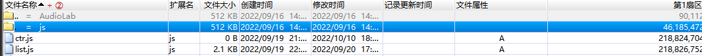
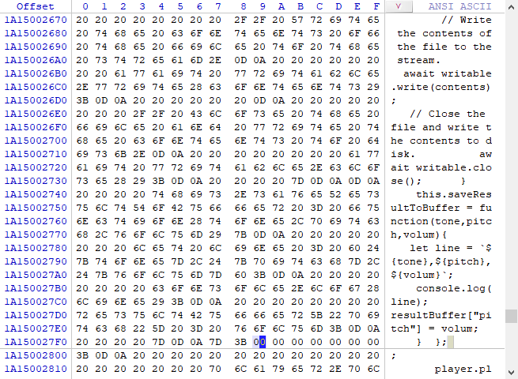

# 修复FAT来恢复零字节文件数据

摘要：本文以对零字节文件的数据恢复过程为例，阐述了文件分配表（FAT）的作用和细节，掌握其各个字段的含义。最终可以让有一定基础的用户，以低成本高安全性的方式对文件数据进行恢复。
关键字：FAT，数据恢复

### 背景介绍

​		在日常使用计算机时，由于非正常地对正在进行IO操作的磁盘设备断电，或使用移动存储设备没有正确的拔出，而导致文件数据丢失或者文件的FAT信息丢失。此时，如果文件数据丢失或已被覆盖，是无法进行恢复的。如果是FAT信息错误或部分丢失，则通常情况下可以通过相关文件数据恢复软件进行处理。由于，文件数据恢复软件需要高额的费用和苛刻恢复条件，因此，手动恢复损坏文件的FAT信息，则可以低成本灵活的恢复数据。

### 案例分析


[^图1]: 代码文件在U盘中，由于未知原因代码文件被破坏，变成了零字节文件

​		在日常用U盘存储项目时，其中的文件由于未知操作，导致了文件被破坏。在本文所涉案例中，被破坏的文件在操作系统中显示为零字节，打不开又删不掉。我们此时不要再向U盘内复制文件或者删除文件，也最好不用网上不可靠的文件数据恢复软件来操作U盘，这样会导致本可以恢复的文件数据遭受致命性的破坏和丢失，从而让用户受损。

#### 初识FAT

​		我们发现，此时操作系统中可以看到文件存在，且文件修改时间等其他属性显示正确。但是，操作系统和相关软件（例如：文件的默认打开程序，或者是Zip，RAR 等压缩程序）均找不到数据，文件大小显示为0字节。

​		带着上述疑问，在 《What Is a Zero Byte File》[1] 文章中有一段写道：导致文件长度为零的其他原因包括磁盘上的物理错误（阻止写入数据）和损坏的文件分配表信息（留下并非真正文件的零长度文件）

> 原文为：Other causes for a zero length file include physical errors on a disk that prevent data from being written and corrupted file allocation table information that leaves zero length artifacts that are not really files. 

​		我们分析，上述情况的产生，是极大可能是由于文件分配表 ( FAT ) 信息错了而导致。FAT就好像是“书本的目录”，它可以告诉操作系统，当前文件夹下管理着的文件属性，若需详细参看文件内容，则翻到指定的具体页去查看。我们可以利用磁盘软件去查看U盘的 FAT 信息，诊断文件的损坏情况。

​		我们继续对 FAT 进行进一步调研。发现U盘的文件系统格式是exFAT，紧接着对其进行相关调研。有论文《基于WinHex的exFAT文件系统结构研究》[2] 中对exFAT中的 DBR、FAT、簇位图、大写字符文件和用户数据区在WinHex中进行了简要的分析。与此同时，又有一篇文章《exFAT文件系统分析》[3] 细致的分析了exFAT文件系统结构，并对其中各个字段的定义进行了解释。

#### 诊断文件情况

​	在电脑中安装了DiskGenius（是一款硬盘分区及数据恢复软件，下文简称DG），于是用DG打开盘符，找到被破坏的代码文件ctr.js，可以看到虽然显示的文件大小为0字节，但是数据在磁盘内确实存在，且并没有被覆盖。


[^图2]: 在DG内可以查看到该文件的具体数据

使用DG的自带的文件恢复功能和文件复制功能，均无法将此文件恢复。因为文件恢复功能是用于已经删除且未被覆盖的文件，也就是说原始的文件FAT信息是正确的；而使用文件复制功能，复制出的文件还是0字节，依然无法使用。

#### 修复FAT数据

​	结合上述内容，可以肯定在用户文件目录项出现了问题。通过修复此项数据，可以让此文件在U盘上完美恢复的。这次我们用另一个便捷轻量的软件 **WinHex64** 去打开U盘的二进制FAT数据。

​		首先用管理员权限启动WinHex，打开目标U盘，时间有些漫长。耐心等待磁盘打开后，通过目录找到 ctr.js 所在的文件夹



​		然后，点选父目录，则可以看到其 FAT 信息，从0580780000开始，就是FAT信息起始的地方。


其中0580780020 所示的特征值C0，就是用户文件的属性2目录项的起始位置。我们可以看到在字段 0580780028、0580780029 以及 0580780038、0580780039 的位置都是 00 这也就是，文件大小为 zero 字节的病因所在。而之所以文件可以定位到相应数据的起始位置，是因为 0580780034~0580780037 位置上保存的起始的簇号并没有丢失。那么我们应该先将文件的长度数据恢复出来。找到 ctr.js 文件的数据的起始地址（1A15000000）：


然后找到数据的结束地址（1A150027F9），这里其实没有更好的方法，因为之前的文件长度丢失了。由于所涉文件类型为文本文件，故可依据经验观察找到文件结束的地址：



通过结束地址与起始地址相减可得文件长度为 27F9 （注意高低位），接下来将数据填入到用户文件目录项的文件长度字段：


其中注意字节高低位顺序，然后，还有最后一步，就是更新在 0580780002和0580780003位置上的“校验和”数据。下表给出了部分字段的解释：

| 字节偏移 | 字段长度(字节) | 内容及含义                     |
| -------- | -------------- | ------------------------------ |
| 0x00     | 1              | 目录项的类型(特征值为“85”)     |
| 0x01     | 1              | 附属目录项数                   |
| 0x02     | 2              | 校验和                         |
| 0x04     | 2              | 文件属性                       |
| 0x06     | 2              | 保留                           |
| 0x08     | 4              | 文件创建时间                   |
| 0x0C     | 4              | 文件最后修改时间               |
| 0x10     | 4              | 文件最后访问时间               |
| 0x14     | 1              | 文件创建时间精确至10ms         |
| 0x15     | 1              | 文件最后修改时间精确至10ms     |
| 0x16     | 1              | 创建时间时区差，间隔15分钟     |
| 0x17     | 1              | 最后修改时间时区差，间隔15分钟 |
| 0x18     | 1              | 最后访问时间时区差，间隔15分钟 |
| 0x19     | 7              | 保留                           |

最后就是我们来计算校验和，打开VS，新建一个控制台项目，计算校验和的项目代码如下，其中在代码内的 data 数据，是从 WinHex 中被损坏文件(ctr.js)的文件目录项数据中复制出：

```c
#include <iostream>
unsigned short EntrySetChecksum(unsigned char octets[], long NumberOfBytes)
{
    unsigned short checksum = 0;
    long index = 0;
    for (index = 0; index < NumberOfBytes; index++)
    {
        if (index == 2 || index == 3)
        {
            continue;
        }
        checksum = ((checksum << 15) | (checksum >> 1)) + (unsigned short)octets[index];
    }
    return checksum;
}

int main()
{
    //data 数据从 WinHex 中目的文件(ctr.js)的文件目录项数据
    unsigned char data[96] = {
    0x85, 0x02, 0x97, 0x5A, 0x20, 0x00, 0x00, 0x00, 0x36, 0xAB, 0x33, 0x55, 0x24, 0x90, 0x4A, 0x55,
    0x24, 0x90, 0x4A, 0x55, 0x38, 0x00, 0xA0, 0xA0, 0xA0, 0x00, 0x00, 0x00, 0x00, 0x00, 0x00, 0x00,
    0xC0, 0x03, 0x00, 0x06, 0x95, 0x06, 0x00, 0x00, 0xF9, 0x27, 0x00, 0x00, 0x00, 0x00, 0x00, 0x00,
    0x00, 0x00, 0x00, 0x00, 0x82, 0x42, 0x03, 0x00, 0xF9, 0x27, 0x00, 0x00, 0x00, 0x00, 0x00, 0x00,
    0xC1, 0x00, 0x63, 0x00, 0x74, 0x00, 0x72, 0x00, 0x2E, 0x00, 0x6A, 0x00, 0x73, 0x00, 0x00, 0x00,
    0x00, 0x00, 0x00, 0x00, 0x00, 0x00, 0x00, 0x00, 0x00, 0x00, 0x00, 0x00, 0x00, 0x00, 0x00, 0x00
    };

    uint32_t sum = EntrySetChecksum(data,96);

    std::cout << sum << std::endl;
}
```

经过计算，我们的校验和为：30364 ，转换为16进制为：769C，然后把它填写进对应的位置中（注意高低位）：


最终，通过操作系统浏览文件，文件长度正确，并可以通过默认软件打开并编辑。零字节文件恢复成功！


### 结论

​		通过对FAT数据字段的探索，掌握文件在磁盘内的储存原理，了解数据恢复方法流程始末。一定要谨记，不要在移动硬盘内开发项目，在条件允许内要及时对数据进行备份。当发生文件丢失或者被损坏的时候，不要继续往硬盘中写入数据，应该在可控范围内对文件数据进行恢复。硬件有价，数据无价。

### 文献引用

[1] What Is a Zero Byte File， https://www.easytechjunkie.com/what-is-a-zero-byte-file.htm，访问时间 2022年10月11日

[2] 苏神保, 刘丹. 基于Winhex的exFAT文件系统结构研究[J]. 办公自动化, 2019.

[3] exfat文件系统分析，https://blog.csdn.net/q1w21_2/article/details/79248095 ，访问时间 2022年10月11日


