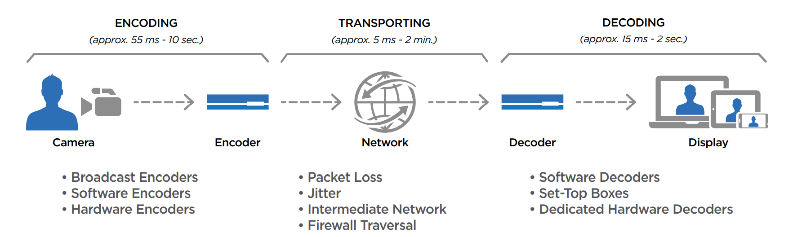

## NDI 、 SRT 和 SMPTE 的相互较量

*关键词：UDT，FEC，SMPTE 2022 C & D*，HD-SDI，3G-SDI

#### 什么是SRT：

安全可靠传输(SRT)是一种传输协议，用于超低(亚秒级)延迟的实时视频和音频流，以及一般的批量庞大数据传输。SRT作为一种开源技术，其代码可以在GitHub上获得，它是一个已发布的互联网草案，而且SRT用户的社区也在不断增长。

SRT应用于贡献和分发端点，作为视频流工作流的一部分，以在任何时候交付最佳质量和最低延迟的视频。

在实时流媒体配置中，SRT协议保持恒定的端到端延迟。这允许在接收端重新创建直播流的信号特征，减少了缓冲的需要。当信息流从源端到目的地时，SRT检测并适应两个端点之间的实时网络条件。它有助于补偿由于噪声网络的拥塞而产生的抖动和带宽波动。

SRT实现AES加密以保护媒体流的有效负载，并提供各种错误恢复机制以减少典型的互联网连接的数据包丢失，其中自动重复请求(ARQ)是主要的方法。使用ARQ，当接收端检测到一个包丢失时，它会向发送端发送一个警报，请求重传这个丢失的包。该协议还支持前向错误纠正(FEC)和连接绑定，增加了无缝流保护和无命中故障转移。

#### SRT的特性

- 一流的质量和可靠性

  无论您的网络多么不可靠，SRT可以从严重的丢包和抖动中恢复，确保您的视频流的完整性和质量。

- 低延时

  SRT的流错误纠正是可配置的，以适应用户的部署条件。利用实时IP通信开发来扩展传统的网络错误恢复实践，SRT提供了比TCP/IP延迟更低的媒体，同时提供了UDP传输的速度，大大提高了可靠性。

- 与内容无关

  与其他一些只支持特定视频和音频格式的流协议不同，SRT与有效负载无关。因为SRT在网络传输级别操作，充当内容的包装器，它可以传输任何类型的视频格式、编解码器、分辨率或帧率。

- 轻松防火墙穿越与交会模式

  SRT使用的握手过程支持出站连接，而不存在防火墙中打开永久外部端口的潜在风险和危险，从而保持公司LAN安全策略，并将IT干预的需求降至最低。

- AES加密

  SRT使用128/192/256位AES加密技术，得到世界各地政府和组织的信任，确保有价值的内容从贡献到分发都得到端到端保护，没有未经授权的方可以监听。

- 前向纠错(FEC)和包过滤API

  SRT1.4 介绍了包过滤器API。这种机制允许在发送端对网络数据包进行自定义处理，在从网络接收端接收数据包后，在发送端对网络数据包进行自定义处理。该API允许用户编写自己的插件，从而通过各种不同的包过滤进一步扩展SRT协议的功能。用户可以以任何方式操作得到的包过滤器数据，例如自定义加密、包检查或在发送数据之前访问数据。

  第一个用包过滤API实现的插件是前向错误纠正(FEC)，在某些情况下，它可以提供比自动重复请求(ARQ)稍低的延迟。这个插件允许三种不同的模式:

  - 仅ARQ — 重传丢失的数据包，
  - 仅FEC — 提供接收端FEC恢复所需的开销，
  - FEC和ARQ — 对FEC无法恢复的丢失报文进行重传。

- 连接绑定

  与托管网络上的SMPTE-2022-7类似，连接绑定为SRT协议增加了无缝流保护和无命中故障转移。该技术依赖于多个IP网络路径，以防止在网络拥塞或中断时对直播视频流的中断，保持服务的连续性。

  这是通过使用SRT v1.5中引入的套接字组实现的。套接字组的一般概念是指拥有一个包含多个套接字的组，其中一个用于发送一个数据信号的操作应用于组。组内的单个套接字将接管这一操作，并做必要的工作将信号传递给接收器。

  支持两种模式:

  - 广播 — 在广播模式下，数据在组内所有成员链路上进行冗余发送。如果其中一条链路故障或经历网络抖动和/或丢包，丢失的数据将通过组中的另一条链路接收。多余的数据包在接收端被直接丢弃。
  - 主/备份 — 在主/备份模式下，一次只使用一个(主)链路进行数据传输，而其他(备份)连接处于备用状态，以确保在主链路故障时仍能继续传输。主/备份模式的目标是在潜在链接中断发生之前识别出它，从而提供一个时间窗口，在此时间窗口内无缝切换到备份链接之一。

- 访问控制(流ID)

  访问控制允许上游应用程序为单个SRT流分配一个流ID。通过使用唯一的流ID(自动生成或自定义)，上游应用程序可以向单个IP地址和UDP端口发送多个SRT流。然后，接收方可以使用流ID来识别和区分接收流，应用用户密码访问方法，在某些情况下甚至应用基于流ID命名的自动化。例如，可以将贡献发送到视频生产工作流，并将监控发送到监控服务。

  对于广播来说，流ID是取代RTMP以接收视频流的关键，特别是HEVC/H.265的内容，到云服务或cdn有一个单一的IP套接字(地址+端口)为传入的视频开放。

#### SRT的发展

基于TCP的方法。直播的问题：网络拥塞，丢包恢复太慢。

基于UDP的方法。一般问题：包丢失，抖动，包重新排序，延迟

可靠UDP。添加帧和选择性重传。

脏网络（delay, jitter, packet loss and its recovery）会导致接收端信号的特性改变，会导致解码问题。SRT在接收端重新创建信号特征。这样我们就能大大减少缓冲。这个功能是SRT协议本身的一部分，因此一旦数据从接收端SRT协议中出来，流的特征就被正确地恢复了。

SRT在2013年首次公开展露头角，在2017年被开源。

------

### SRT与RTMP的对比

比较RTMP和SRT的延迟：端到端的延迟，被称为glass-to-glass延迟。即单帧视频从相机传输到显示器所需要的总时间。有许多因素会导致延迟，这取决于交付链和涉及的视频处理步骤的数量。虽然单独来说，这些延迟可能是最小的，但累积起来就会变大。它们包括编码、解码、传输媒介(互联网、卫星、无线电、光纤等)、源(照相机、视频播放机等)和显示设备。

##### 源

采用Blackmagic Hyperdeck Shuttle视频录像机作为视频源，直接提供第一屏，同时使用海视KB和Makito X视频编码器。该视频有一个内置的时间码，以便识别每一帧。该视频资产的播放分辨率为720p，每秒60帧。每一帧视频的可见时间为16.67毫秒。

##### 屏幕

为了能够拍摄出直接显示编码、流媒体和解码所需时间的照片，使用了多个屏幕。为了确保屏幕在延迟上没有差异，所有的显示器都平行连接到源，并拍摄了一张照片。所有的屏幕在同一时刻显示出完全相同的画面。在将两个屏幕都连接到笔记本电脑上的情况下重复了这个测试，以确保笔记本电脑的内部显示速度不会比使用的屏幕慢或快。

##### 视频编码器

基带视频信号由Haivision KB迷你视频编码器(软件版本5.4)编码，能够并行生成RTMP和SRT流。两个输出流使用相同的视频和音频过程。传出比特率的差异取决于RTMP和SRT使用的单个协议开销。

|              |              |
| ------------ | ------------ |
| 分辨率       | 720p         |
| 视频帧率     | 60FPS        |
| 比特率       | 2136kbps     |
| 视频编码     | H.264 主编码 |
| GOP 固定间隔 | 2000ms       |
| 视频熵       | CAVLC        |
| 音频比特率   | 192kbps      |

> GOP就是两个I帧之间的间隔
>
> 在视频编码序列中，主要有三种编码帧：I帧、P帧、B帧，如下图所示。
>
> - I帧即Intra-coded picture（帧内编码图像帧），不参考其他图像帧，只利用本帧的信息进行编码
> - P帧即Predictive-codedPicture（预测编码图像帧），利用之前的I帧或P帧，采用运动预测的方式进行帧间预测编码
> - B帧即Bidirectionallypredicted picture（双向预测编码图像帧)，提供最高的压缩比，它既需要之前的图像帧(I帧或P帧)，也需要后来的图像帧(P帧)，采用运动预测的方式进行帧间双向预测编码

总传出比特率加起来大约是3Mbps，包括协议开销。

此外，使用了Haivision Makito X视频编码器和解码器(固件版本2.3)。与基于软件的编码/解码过程相比，这些硬件加速设备允许更低的延迟。两者的编码配置文件使用与KB软件编码器相同的参数

##### 视频解码器

由于容易复制测试设置的能力是一个关键焦点，选择的软件解码器是VLC播放器，这是工业和家庭使用最广泛的视频播放器之一。高度通用和非常流行，VLC解码广泛的格式，包括RTMP和SRT流。

在这个测试中，使用了一个标准设置的干净的VLC安装。标准缓存级别250毫秒适用于大多数测试，但在某些情况下必须更改。关于这方面的详细信息可以在时间戳、缓存和缓冲区一节中找到。

##### Wowza服务器

作为RTMP流的目标，使用了Wowza流引擎(版本4.7.5 - build 21763)。Wowza流媒体引擎托管在AWS实例上，这些AWS实例位于与海视媒体网关相同的AWS数据中心中，它们充当SRT流的流目标。解码器(VLC)将RTMP流从特定的服务器拉回编码器的位置。

Wowza流媒体引擎也支持SRT，但在测试时，它的SRT实现使用了一个非常老的协议版本，并没有代表当前SRT版本的全部潜力。此外，在测试Wowza的流媒体云的时候，还没有SRT实现。

到Wowza服务器和到托管在同一个AWS数据中心的Haivision媒体网关的往返时间(RTT)的差异从不超过2毫秒。在大多数测试中，总RTT是相同的

##### 海视媒体网关服务器

类似于RTMP设置，托管在AWS实例上的Haivision Media Gateway(版本3.0.1)被用作SRT流的端点。在AWS内部，海视媒体网关以软件即服务的形式提供，可以在您选择的AWS数据中心中进行植入。

SRT流的输入和输出被配置为具有定义的延迟缓冲区的SRT侦听器端口。这个缓冲区的大小取决于端点之间连接的RTT。有关详情，请参阅以下章节: 时间戳，缓存和缓冲区。

##### 网络连接

与互联网的上行链路由Fritzbox 7590 DSL调制解调器建立，下行链路为100mbps，上行链路为42mbps。连接的性能始终被监控，以确保链路不会被其他应用程序占饱和。

##### 时间戳，缓存和缓冲区

RTMP和SRT之间的一个主要区别是在RTMP流包头中没有时间戳。RTMP仅根据帧速率包含实际流的时间戳。单个数据包不包含此信息，因此RTMP接收器必须在固定的时间间隔内将每个接收到的数据包发送到解码进程。为了消除单个数据包传输时间的差异，需要较大的缓冲区。

另一方面，SRT包含每个包的时间戳。这使得在接收端的信号特征重现成为可能，并极大地减少了对缓冲的需求。换句话说，离开接收器的比特流看起来和进入SRT发送器的比特流完全一样。

RTMP和SRT的另一个显著区别是包重传的实现。RTMP基于TCP，它依赖于接收方报告的确认。然而，这些确认(ack)不会立即报告给发送者，以保持低的返回流量。只有在接收到一系列数据包后，才会发送回ack或nack(否定确认)报告。如果在该序列中有丢失的数据包，则重传完整的数据包序列(返回到最后一个ACK)

相比之下，SRT可以通过序列号识别单个丢失的数据包。如果序列号delta多于一个数据包，则触发该数据包的重传。只有那个特定的包被再次发送，以保持较低的延迟和开销。

根据Wowza论坛，缓冲区大小计算如下：

> 更大的SendBufferSize和ReceiveBufferSize将在有很多延迟(高ping时间)的连接上提供更好的吞吐量。以字节/秒为单位的吞吐量必须低于缓冲区大小/ rtt(往返时间)。缓冲区的大小决定了在发送端必须停止并等待接收端的回复之前可以发送多少数据。用于连接的大小将是发送方的发送缓冲区或接收方的接收缓冲区中较小的一个。一般来说，大多数现代客户端都会使用自动设置，所以Wowza上的发送缓冲区可能会限制高延迟连接的连接速度。
>
> 默认情况下，Wowza使用65000作为发送缓冲区，因为这是一个很好的平均值。这将为您提供以下性能数据:
>
> 65000 bytes / 50ms RTT = 1300000 bytes / SEC = 10.4mbps
>
> 65000 / 100ms = 5.2mbps
>
> 65000 / 200ms = 2.6mbps
>
> 正如你所看到的，客户端播放器离你越远，它从你的服务器流出的吞吐量就越少。除非你的播放器离你很远，否则默认设置对于你所描述的流和播放器应该是没问题的。如果将吞吐量设置得太低，可能会严重限制吞吐量。低延迟设置适用于玩家非常接近服务器或流比特率非常低的情况。
>
> 16000 bytes / 50ms RTT = 320000 bytes / SEC = 2.56mbps
>
> 16000 / 100ms = 1.28mbps
>
> 16000 / 200ms = 640kbps
>
> Wowza上的接收缓冲区大小通常只影响直播流的发布，所以这些应该设置为允许你的发布编码器有足够的带宽。如果您设置的大小太大，那么当出现拥塞时，您就会遇到问题，因为服务器将需要更长的时间来检测和调整以克服拥塞。因此，您不应该将这些值设置得太大。如果你知道玩家和发行商之间的距离有多远，你就可以使用手动设置。

总结:如果你不知道你离你的摄入点有多远(根据RTT)，并且你不确定你的连接的特征：使用SRT。

在执行的测试中，尽可能使用缺省值65,000字节。然而，对于RTT为360毫秒的澳大利亚流，缓冲区被增加到26万字节，以实现稳定的流。

#### RTMP vs. SRT - Latency vs. RTT

正如预期的那样，到流目标目的地的距离越远，对端到端延迟的影响就越大。值得注意的是，这些数字是绝对的端到端延迟数字，包括:编码、传输、解码和显示设备延迟。它们也是双向的，往返的延迟，例如，从德国到澳大利亚，再回到德国

| Route                              | RTT    | VLC Buffer (RTMP / SRT) | RTMP    | SRT     |
| ---------------------------------- | ------ | ----------------------- | ------- | ------- |
| Germany - APAC Sydney - Germany    | 360 ms | 2000 / 250 ms           | 9635 ms | 2934 ms |
| Germany - US California - Germany  | 178 ms | 700 / 250 ms            | 5318 ms | 2250 ms |
| Germany - US N. Virginia - Germany | 212 ms | 250 / 250 ms            | 4851 ms | 2267 ms |
| Germany - DE Frankfurt - Germany   | 17 ms  | 250 / 250 ms            | 4168 ms | 1584 ms |

> Round Trip End-to End Latency (RTMP / SRT)

你离流的目的地越远，流到达所需的时间就越长。因此，从地球的一端流到另一端，在这种情况下，从德国到澳大利亚，花费的时间最多，这并不奇怪。

**德国-悉尼-德国**

为了使用RTMP使稳定的视频和音频流从德国到达悉尼，Wowza流媒体引擎上的接收缓冲区必须增加到260000字节。这是缺省值65,000字节的4倍。由于测试基于双向流，VLC播放器的接收缓冲区也必须从默认值250毫秒增加到2000毫秒。低于这些值的流质量会因音频和视频工件而下降，甚至根本不播放。

**德国-加利福尼亚-德国**

虽然与澳大利亚相比，往返加利福尼亚的时间大约是一半，但RTT并不是影响延迟的唯一因素。返回德国的路径似乎经历了高抖动，这导致了每个包的旅行时间的差异。虽然从德国到加利福尼亚的流媒体使用默认的缓冲区大小为65000字节，但在VLC播放器中返回路径需要增加缓冲高达650毫秒。

**德国-弗吉尼亚-德国**

有点令人惊讶的是，测试结果显示，弗吉尼亚的RTT略高于加州(少于3帧或50毫秒)，尽管从地图上看，它与德国的距离明显较短。由此我们可以得出结论，最短的地理路径并不总是最快的。数据在数据中心和路由器之间以光速传输。

根据数据链路的容量利用率，视频信号可能并不总是沿着最短的互联网路径传播，而是沿着更快的路径而不是更直接的路径传播。虽然RTT略高于加州测试，但链接更稳定，抖动更少，允许较小的RTMP缓冲区。视频流是稳定的默认值- 65,000字节缓冲在Wowza流媒体引擎和250毫秒VLC。

**图林根-法兰克福-图林根**

对于从图林根州到法兰克福AWS数据中心的德国流测试，RTT仅为17毫秒。与弗吉尼亚或加利福尼亚的结果相比，使用RTMP的往返端到端延迟并没有减少多少。然而，与美国位置相比，SRT协议能够在较低的RTT下获得超过1秒的时间

**在这些测试中，SRT比RTMP快2.5到3.2倍。**

到目前为止，我们已经探索了软件编码和解码，即使使用SRT最快的结果也在1.5秒以上。对于延迟非常关键的用例，1.5秒远远超过了动态双向访问等流体交互的期望阈值

在新闻广播中，延迟是很明显的，例如，当一个美国记者接受一个使用卫星传输的欧洲电视频道采访时。在提出问题和给出答案之间的任何延迟都是显而易见的。

通常情况下，被采访者都接受过媒体培训，经常提前知道被问到的问题，所以会在对方回答完问题之前就开始回答。如果延迟是1.5秒，那么延迟将非常明显。

SRT有助于显著降低数据传输的延迟，硬件编码器和解码器，如海视的Makito X系列，也将加快视频编码和解码。下图显示了海视KB编码器通过RTMP和SRT转换到VLC的结果，与海视Makito X编码器通过SRT转换到解码器的结果进行了比较。

使用Makito X编码器和SRT解码器的结果显示了显著的差异。当使用专用硬件编码和解码时，往返澳大利亚的双向端到端延迟从9.6秒减少到1.6秒。在德国，SRT只需333毫秒，而软件中的RTMP则需要4.1秒。这是12倍的速度，可以被认为是超低延迟。

#### 比较RTMP和SRT协议的最大带宽

测试结果证明SRT对降低视频延迟有显著影响。但它对视频质量的影响呢?提高视频和音频质量的一个简单方法就是增加用于流媒体的带宽。但是长距离流的最大带宽是多少?高带宽流能走多远?

##### 带宽测试设置

为了测试高带宽流媒体，我们选择了一个互联网连接良好的地点，位于华盛顿州雷德蒙德的微软制作工作室。下一个主要的互联网节点只有2跳的距离，所有连接的设备都有真正的1gbps连接到互联网。

考虑到低延迟仍然是测试的重点，在测试期间增加带宽时，缓冲区设置保持不变。缓冲区的大小是用2mbps流测试的。一旦稳定下来，就使用1、2、6、10和20 Mbps流进行测试。

一个海视KB 5.4编码器提供的流被发送到位于美国加州和北弗吉尼亚的AWS数据中心的海视媒体网关、德国法兰克福和澳大利亚东部悉尼。为了判断视频的质量，流通过SRT发送回雷德蒙德，并在海视Play 2000机顶盒上播放

##### 带宽测试结果

测试结果是决定性的。SRT没有遇到任何问题，传输到世界上任何地区的流量高达20mbps。当发送方和接收方都在同一大洲(在本例中是北美)时，RTMP工作良好。从雷德蒙德，可以使用RTMP发送高达20mbps到加利福尼亚或弗吉尼亚。然而，在比特率超过2mbps的情况下，流媒体传输到欧洲和澳大利亚是不可能的。使用SRT，甚至可以实现更高的比特率，但由于RTMP已经在通过公共互联网的较长距离上以较低的比特率失败，因此对于这个特定的测试来说，20mbps是一个很好的上限

##### 结论

在端到端延迟和最大可转移比特率方面，SRT远远优于RTMP。虽然这些测试可以在实验室环境中进行，使用工具增加包丢失和高抖动，但我们有意选择使用公共互联网执行这些测试。真实世界的条件很难在实验室中复制，而且总是一种近似。

展望未来，海视即将推出一项新的创新，SRT Hub，它将提供公共互联网流媒体的另一种选择。SRT Hub由SRT提供支持，是一种基于云的路由服务，它利用了全球Microsoft Azure网络的可伸缩性和覆盖范围。这将减少通过互联网到达入口和出口点的跳数，将延迟降低到更低的水平

------

### SRT和NDI有什么区别?（商业水文）

SRT和NDI都是用于网络流媒体的协议。它们是相似的，但也有一些差异，使它们各自更适合不同的场景。

**优点**

更容易和更快的部署:SRT和NDI协议是非常轻量级的，这意味着它们可以在几分钟内部署。相比之下，其他流行的流媒体技术需要在您的计算机上安装特殊的硬件或软件。这不仅令人讨厌，而且需要花费大量时间来安装和配置所有内容。使用SRT和NDI，您不需要做任何额外的工作就可以开始。你所需要的只是一个视频源(如网络摄像头)和一个流媒体服务器(如Wirecast)。你可以马上开始流媒体!

更可靠:因为不涉及专有软件，任何人都可以很容易地访问您的流并观看直播。你不必担心人们是否能看到你的流;有了SRT和NDI，这是有保证的!这与人们使用什么类型的设备无关;他们仍然能够观看你的流媒体，只要他们有互联网连接，知道你从哪里流媒体(例如，Twitch)。这使得它比其他需要复杂配置的方法要方便得多

**缺点**

SRT和NDI的主要问题是它们不像HD-SDI或3G-SDI那样广泛使用，所以您可能被限制在较小的设备范围内。

此外，SMPTE 2022 C和D是新标准，只有少数设备支持。当涉及到视频数据的格式时也有一些限制。例如，SMPTE 2022 A要求像素长宽比(PAR)为1:1，而大多数HD源使用的PAR为16:9或16:10。

使用NDI，您可以使用任何源格式，但由于NDI是一种网络协议，如果网络连接不够快，延迟可能会成为一个问题。好消息是，与以前的NDI版本相比，延迟已经大大减少了，所以这通常不再是一个问题——特别是当您通过千兆以太网或更快的连接进行流媒体传输时。

------

### SMPTE or NDI

展望同轴连接视频信号之后的生活，许多人想知道该选择SMPTE还是NDI?我们怎么会走在IP视频制作的岔路口?

一个简单的事实是:几十年来，数字视频生产的演变是一个相当标准和无竞争的过程。美国电影电视工程师协会(SMPTE)率先制定了电影行业多年来一直依赖的标准。随着每一次演进，支持新的更高分辨率格式，但继续使用带BNC连接器的同轴电缆。如果你需要扔一个特别长的距离，那么基带光纤替代品也是一个选择。

那么，为什么我们在开发新的生产设备时，系统架构师还得做出判断呢?答案很简单:无论是NDI还是SMPTE IP都不是“最优”的，因此要选择正确的选择要困难得多。

##### 推进

第一个重要的IP格式SMPTE ST 2022出现在过去十年，基本上是SDI分组到IP流。尽管不是非常灵活，但它过去和现在都有用途。然后是SMPTE ST 2110；通过将视频、音频和元数据分离到单独的IP流，它提供了更大的功能，允许设计师创建简化工作流程和显著减少硬件的设施。还有其他的优势，不胜枚举，但一个关键的优势打开了远程生产的大门，摄像机和位于不同国家的生产画廊之间有一个有用的电信;全球电视转播的体育运动从未回头。

在过去十年的后半段，包括我们在内的制造商都支持SMPTE ST 2110。选择很简单，前途一片光明，不是吗?现实情况是SMPTE ST 2110需要非常高速的IP基础设施，成本与之匹配。远离高度组织的演播室和外部广播环境，SMPTE ST 2110的光纤传输可以显示其脆弱性，使决策者紧张。记住，让外景剧停止使用胶片花了很多年的时间!

这一背景一直是NDI的优势，它起源于NewTek，现在是Vizrt旗下的一家商业技术子公司。它的口号可以总结为“keeping it copper—IP video should be transported over cheaper Cat5/Cat6 networks”这里的电缆坚固而熟悉，网络基础设施不需要4万美元的培训来管理。

然而，有一个很大的“然而”，视频是压缩的。广播工程领域的纯粹主义者们嗅了嗅，扭头一看，对此不屑一顾，因此NDI在黑暗中坐了比它本应呆的时间更长的时间。几乎所有到消费者的路径都会导致视频被压缩，那么为什么压缩会影响到工作流程呢?好吧，它可能不会，因此我们看到越来越多的制造商支持NDI。NDI的“缺点”之一是其有限的接受度，但这正在成为历史。

压缩本身可能令人困惑，因为NDI品牌有多种类型。NDI通常被称为“完全NDI”，它基于SpeedHQ支持的变体SHQ2和SHQ7(都是4:2:2的视频类型)，导致HD比特率在100Mb/s左右。NDI的其他版本HX是H264/H265，这取决于它是HD还是4K (UHD)。NDI- hx的比特率要低得多，为了避免SMPTE ST 2110的成本，它可能会被排除在更多“高级”生产环境之外，但非hx的NDI非常好，当你考虑到不久之前观众还在“享受”交错的标准定义时。

##### 比看上去要复杂得多

我提到的那些“纯粹主义者”会抗议说，我把问题过于简化了，显然忽略了压缩延迟等重要因素。他们当然是对的;但真正的情况要复杂得多。电影、CGI和戏剧工作流程仍然需要最小的压缩，如果不是零压缩的话，我强烈怀疑在外景制作中，12Gb/s的基带SDI将会有很长的寿命。

最终我们都将实现IP，硬件只会出现在“边缘”，所有的处理、分发和存储都将牢牢地放在云端。当然，哪一种格式会胜出还很难预测。如果SMPTE ST 2110及其最终继任者的发现模型(如何识别和查找多媒体IP设备)成熟，那么由SMPTE标准化的未压缩视频可能会领先。

对于NDI来说，要想在竞争激烈的市场中占据一席之地，可能要靠商业手段。在与NDI团队过去和现在的高级人物交谈了一段时间后，我相信，制造商必须支付的费用将决定NDI的接受程度。

我们可能会在未来五年看到一场战争，由此产生的不确定性将使选择变得困难。我不会做任何预测，但我要说的是，在我们的视频技术中引入了对SMPTE ST 2110的支持之后，我们目前正在为今年的IBC之前的NDI支持做最后的润色。

> https://www.tvtechnology.com/opinion/life-after-co-axial-smpte-or-ndi   published 2022/8     visited 2022/9/19

------

### SRT 和 NDI 的比较

##### 关于SRT：

SRT是由Haivision和Wowza共同创建的互联网传输协议，是时下非常受欢迎的开源低延迟视频传输协议。使用SRT传输技术，能够成功实现普通互联网环境下、多地之间、安全可靠的高清视频传输与分发。

##### 关于NDI：

NDI是NewTek公司于2015年推出的网络设备接口协议，是一种基于局域网络的信号传输协议。使用NDI传输技术，在局域网内的一个设备可以通过一条网线输出或者接收多个NDI信号，可完全取代传统SDI/HDMI视频线传输，它让视频在IP空间进行简捷高效的传输已成为现实。

##### SRT和NDI：使用带宽

SRT协议是基于H.264/H.265压缩方案的传输协议，传输带宽可调，比如高清视频可自定义设置4-20Mbps均可。SRT的抗丢包机制是是ARQ（自动重复请求）纠错机制。在网络传输中，带宽抖动和丢包通常都是随机发生的，只有在网络出现问题的时候才需要纠错机制的介入，ARQ机制只需在发生丢包后让发送端重传丢失的数据包即可，这样既保证了传输的质量，同时又能减少无谓地消耗传输带宽。 

NDI世界有两个版本，一种是NDI|HX，一种是Full NDI。NDI| HX是H.264的变种，目前已迭代到NDI|HX2，传输带宽可调，1080P60视频默认为10Mbps。Full NDI是I帧帧内压缩方案，目前已迭代到NDI 4.5，在传输过程中，Full NDI需要占用一定带宽，高清带宽90-180Mbps，4K带宽在200-300Mbps，NDI传输建议使用千兆网络，适用于对画质要求高的应用，如节目制作工作场景。

##### SRT和NDI：传输延时

SRT是一种能够在复杂网络环境下实时、准确地传输数据流的网络传输技术，它在传输层使用UDP协议，具备UDP速度快、开销低的传输特性，支持点对点传输，无需中间进行服务器中转（仅需任意一端具备固定公网IP地址即可），互联网点对点传输可小于1s。

NDI是能够允许局域网络内的设备对信号进行高质量传输，在局域网内的一个设备可以通过一条网线输出或者接收多个NDI信号，不需要复杂的布线，局域网内端到端延时仅为1-3帧（小于100ms）。从实际应用来看，Full NDI端到端延时小于100ms，NDI| HX端到端延时约100+ms。

##### SRT和NDI：应用场景

SRT可广泛应用于节目远程制作（上云）、活动直播主分会场视频连线、互联网远程教学培训、集团公司对异地施工现场视频监管、法院庭 审远程连线等行业，以及其他需要在互联网远程视频传输的场合。同时需要注意的是，SRT传输应用需要发送端或接收端任意一端具备固定公网IP地址。

NDI广泛应用于电视节目本地/远程制作、NDI投屏、NDI视频会议、超低延时手术示教等行业，以及一些需要更便捷、低延时、高画质的视频传输场景。NDI目前适用于局域网内传输，但通过协议转换技术方案，亦可实现NDI流跨互联网传输。

------

### 从SDI到IP迁移，但SMPTE 2110不是答案

##### BROADCAST VIDEO OVER IP "STANDARDS"

##### SMPTE 2110问题

SMPTE 2110在有限的使用场景下(例如在工作室内)是可以的，尽管很难看出它比SDI有什么好处。这是大多数广播视频通过IP解决方案的普遍问题——因为几乎没有支持各自IP标准的摄像机，SDI摄像机输出仍然需要转换到IP，然后再返回到SDI，例如连接监视器、视觉混合器或其他任何东西——而且到处都是这样。出售转换器或“网关”的供应商赚的钱最多。

所有这些都可以被视为分娩的痛苦，但现在，如果行业告诉广播公司，SMPTE 2110是一个可以解决所有问题的解决方案，如果你不想被落在后面，最好加入这一潮流。

有很多很好的理由让每个人都不去看这部电影，即使一个人有钱，有超高清和8K的冲动，现在也需要进行基础设施投资。

不要——至少在SMPTE 2110上不要。

##### WHY SMPTE 2110 IS AN UNFIXABLE TRAIN WRECK

从哪里开始?也许通过说它是半生不熟的，未完成的，在所有问题都被解决之前就被推出了门，现在需要由NMOS侧车项目来解决?不，那是假设问题最终能解决。

“解决”IP视频问题的整个方法显示了真正的问题所在——参与解决问题的人的类型。

如果你要求广播硬件工程师解决IP视频问题，那么你得到的是SMPTE 2022-6，它将整个SDI包裹在一个IP流中。要在软件中创建此功能，您需要模拟一个完整的SDI视频卡以及SDI标准的所有遗留“特性”。当然，这是未压缩的，一个简单的1080i视频流至少1.5Gbps。

在创建SMPTE 2022-6(本质上仍然是SDI，只是将传输介质连续串行流交换到分组以太网)受到强烈反对之后，SMPTE 2110现在几乎是另一个极端。现在所有内容都被完全解压缩，并被塞进单独的、描述的基本RTP流中——产生了一系列新问题——当然，它也是未压缩的。

为什么未压缩的?理论上来说，不压缩可能是有理由的。从理论上讲。这种愚蠢的讨论随着每一次技术变革而重新浮出水面。恢复光盘!没有(负担得起)磁带格式，因为模拟Betacam未压缩。是的，D1和D6是，但除了一些广播实验室，没有人买得起它们，也没有人在生产中使用它们。DigiBeta, HDCAM / HDCAM SR等都使用压缩，但仍然没有人抱怨或说质量不够好，不适合高端职位。在电影制作中，大多数电影“RAW”格式使用压缩，许多人更喜欢用高质量的ProRes或DNxHR直接拍摄，以节省空间和制作时间。许多关于未压缩的陈述都是通过传播谎言而保持活力的神话，比如说未压缩具有较低的延迟或需要能够执行适当的色度键。但即使是不压缩的问题也不是真正的问题，它只是创建了不必要的大数据，这严重限制了SMPTE 2110可以使用的使用场景。

##### 真正的优势

SMPTE 2110最大的缺点是，由于它的延迟和抖动要求，几乎不可能在纯软件堆栈中实现它。它可以在VMWARE或Hyper-V等流行的虚拟化环境中运行。目前，让它在标准it服务器上工作的唯一方法是需要一个来自AJA或Deltacast等供应商的物理卡，如果这些已经发布，并且可以工作。这两张卡都不支持UHD，所以如果UHD是你想要的，那就继续搜索。作为一种替代方案，你可以使用一个高端的25G以太网适配器，它具有完整的硬件卸载和专用的驱动程序，这最终与专用的视频I/O卡没有太大的区别。

在VM环境中，这些卡中的任何一个都必须直接通过—每个VM一个卡，或者必须存在特殊的、VM版本特定的驱动程序。对于Mellanox 25G/50G/100G ConnecttX-5卡，其中一些条件已经满足，例如对于VMware。

但归根结底，所有这些目前都无法比SDI带来多少好处，目前SDI仍然相当便宜。最终，基于软件的SMPTE 2110栈将成为可能，但只能使用非常特定的高端企业10/25/50/100G网卡和一些编写良好的驱动程序。这将无法工作通常在PC或服务器主板上已经找到的东西。

一个实时操作系统可以通过简单的网卡帮助实现这一目标——但这将排除使用Windows、MacOS、标准Linux和虚拟化/云。

##### 真正的亮点——第2部分

SMPTE 2110本身并不能真正工作。它奇妙的基本性质将它分为视频(2110-20)、音频(2110-30)和ANC数据(2110-40)和一个独立的时间“流”(2110-10 / SMPTE 2059)，基本上使用PTP驱动的网络计时。这些都不能告诉你你面对的是什么。如果没有会话描述协议提供一个“文本文件”来定义这些流中真正的内容，那么它们就是毫无意义的原始数据。SDP及其控制方式不属于SMPTE 2110的范围。这就是2110需要获得AMWA / BBC研发部门NMOS帮助的地方，这是一颗神奇的子弹，它将解决这一切。与否。事实上，让不同供应商的设备相互交流在现实生活中有点冒险。不同的供应商根据自己的喜好扩展了协议，或者对SDP进行了不同的解释。然后还有安全性和大规模发现的问题。或者谁来指挥的问题，您是否曾经考虑过将两个配备SMPTE 2110的OB卡车连接到彼此的疯狂想法。唯一的解决办法吗?加油SDI或2022-6!

##### SMPTE 2110未压缩带宽-疯狂的数字

让我们做一个例子计算。设定一个简单的目标-将一个小电视台从高清到超高清- 1.5G/3G SDI 1080到超高清，帧率59.94。在这个过程中，现有的3G SDI 64x64路由器将被以太网交换硬件所取代。

使用未压缩的SMPTE 2110意味着UHD数据不能放入单个10Gbit以太网链路中，进一步假设UHD是一个视频流，没有被分割成四个HD流，那么集群化两个10GbE连接也不能工作。这意味着每个UHD流至少使用25GbE。对于smpte2110和UHD，这将是标准。

理论上，您可以将两个UHD@59.94流挤到一个25GbE连接中，但如果源是一个物理设备，如相机、视觉混合器等，那么只有使用另一个本地以太网交换机才能将两个流聚合到一个上行链路中。

多路径弹性是从SDI到IP的一个主要卖点，任何构建SDI到IP替换解决方案的人都将考虑到这一点。这意味着每个UHD信号有两个25GbE连接，每个连接都连接到两个物理上独立的以太网交换机。我们的目标是取代一个3G SDI 64x64路由器，我们现在有以下数字:两个64x25 GbE端口-分割到至少两个物理以太网交换机上。

目前市场上没有独立的64x端口25GbE以太网交换机。有32x端口和48x端口25GbE交换机(有多个100 GbE上行链路)，但在一个盒子中获得64x 25GbE端口的唯一方法是获得例如Cisco Nexus 9500系列模块化交换平台，它可以配置各种模块。最小的有四个空槽的Nexus 9500盒子是Nexus 9504，它需要添加两个或四个48x端口1/10/25GbE线卡(9K-X97160YC-EX)。两张卡组成2x 48 = 96个25GbE端口——所以这是一个冗余的以太网分支，但要实现完全冗余，还需要第二个带有两个48x端口线卡的Nexus 9504。

如果有人认为冗余是胆小鬼的专利，那么一台带有四张卡的Nexus 9504就可以了。但是这样也可以去掉整个多路径冗余，并将所需的端口数量减少一半。

了解广播公司，他们会偷工减料，特别是当他们看到顶级网络设备的价格时。“我们也没有多余的SDI路由器，从来没有出现过问题……”这将是经常听到的说法。“你真幸运!，就是正确答案，紧随其后的是“你当然是对的。”让我们迁移到一个新的，几乎不能工作的IP视频标准，我们没有任何经验，这样做没有另一条腿。裁员是失败者的专利。”这将为公司节省一大笔资金。这应该与更新个人简历、Monster简介和LinkedIn联系方式同时进行。

也许坚持多余的设计是更好的选择，特别是在花别人的钱的时候。一台配备控制器、四个织物模块和两个48倍端口线卡的思科Nexus 9504将花费你或你的雇主大约8万美元——乘以两个冗余——大约16万美元。

不是每个人都需要/想要为思科付费，所以在每个冗余腿上使用两个Mellanox 48x 25GbE / 8x 100 GbE Mellanox MSN2410交换机将略高于思科解决方案的一半价格。替换一个3G SDI路由器仍然需要大约10万美元，这取决于供应商和可扩展性选项，最低不到1万美元(例如AJA Kumo 6464)。

每个思科48x 25GbE线卡的功耗是一个完整的AJA Kumo 6464 3G路由器的12倍，至少需要两个线卡，加上控制器，织物模块，机箱等。每台Nexus 9504(只有两个线路卡)的预期功耗约为1kW。每25GbE端口超过10W。Mellanox 25/ 100g交换机耗电量较低，耗电量仅为AJA Kumo 6464的5倍，或每25gbe端口少于3W。

是的，这是一种小心话，是在拿苹果和梨做比较，但这表明，只要说“这是IP”，它就会自动变得好、聪明或高效。这并不是说IP不好，而是说使用压缩——无论是无损的，视觉无损的，还是轻微无损的，那么整个IP UHD工作流都可以使用10gbe连接，甚至普通的千兆以太网来处理。根据所选择的压缩级别，甚至多个UHD流可以装入单个10 GbE链接中。

由此产生的成本和电力节省是显著的。10G以太网交换机是绝对的商品，并相应地定价。带有10G上行链路的千兆交换机价格便宜得可笑，因此花在快速比较它们上的时间比购买它们要贵得多。

