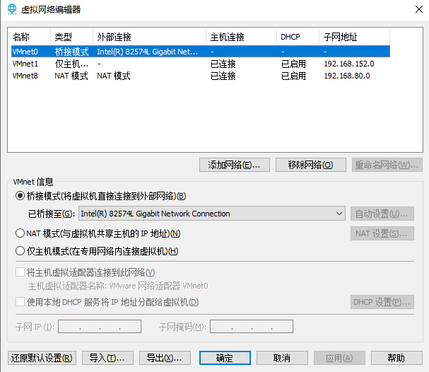
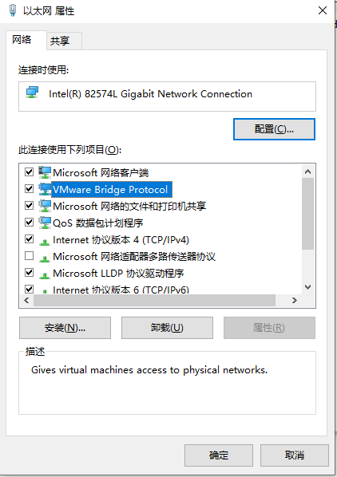
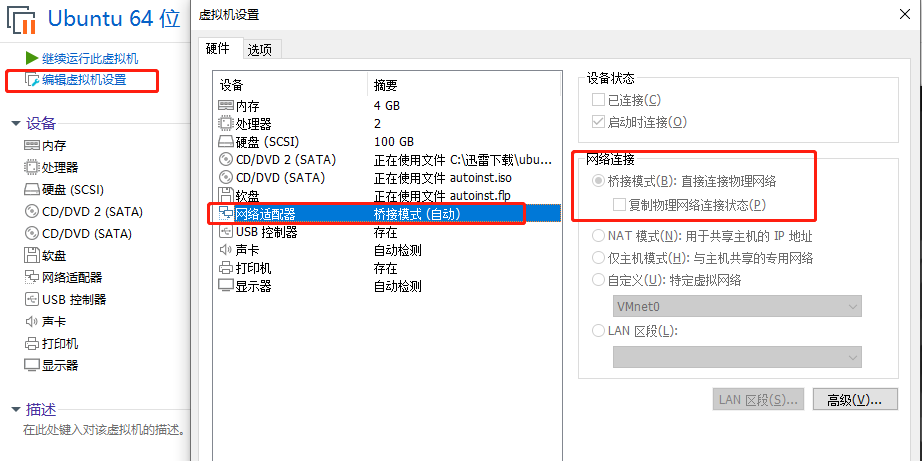

# Ubuntu设置

sudo apt-get update

sudo apt-get upgrade

查看网络服务：

> 查看服务器否开启：netstat -tlp
>
> 启动服务：sudo /etc/init.d/ssh start
>
> 重启服务：sudo /etc/init.d/ssh restart

安装ssh：sudo apt install openssh-server

确认是否正常：sudo systemctl status ssh

Ubuntu 自带一个配置防火墙配置工具UFW。如果防火墙在你的系统上被启用，请确保打开了 SSH 端口：sudo ufw allow ssh

允许root用户远程登录：

在终端上输入 sudo vi /etc/ssh/sshd_config ，进入配置文件，将PermitRootLogin的注释去掉，然后将后面的参数值改为yes

然后重启ssh服务： service sshd restart

安装FTP服务：sudo apt-get install vsftpd

权限设置：sudo vi /etc/vsftpd.conf 命令，将 #write_enable=YES 前面的#去掉，然后保存

然后重启ftp服务：sudo /etc/init.d/vsftpd restart

接下来就可以用 FileZilla工具连接了！工具下载地址：https://www.filezilla.cn/download

------

安装编译工具：sudo apt install build-essential

查看版本信息：

> gcc --version
>
> g++ --version

------

更新下载慢怎么办：

设置 --》关于 --》软件更新 --》下载自：http://mirrors.aliyun.com/ubuntu

------

## Ubuntu安装VSCode编译和调试

***以编译NDI官方examples为例***

首先，确认系统的gcc 、 g++、gdb 是否为安装

然后，在应用商店找到VSCode，并安装。

在VSCode中，下载插件：C/C++ , C/C++ Extension Pack , Code Runner, Makefile Tools

接下来，用VSCode打开 NDIlib_Find 文件夹，则建立了工作区。此时，IDE会提示生成一个配置文件 c_cpp_properties.json ，如不提示则ctrl+shift+P选择C/C++:Edit Configurations，然后，根据需要配置 includePath ，成功后，则编辑器中的cpp文件中可以找到包含NDI下的include目录文件。

然后，运行此cpp，进行调试。ctrl+shift+P，选择 Tasks::ConfigureTasks，配置编译的相关参数。

1. 查看command是否为我们需要的g++

   > gcc -dumpmachine 可以收集到当前编译器的目标机型

2. 设置arg参数：
   - -g	编译生成调试信息
   
   - -std=c++11   标准库使用版本
   
   - -pthread     多线程编译加此参数
   
   - -I    （大写I）设置include路径
   
   - -L   （大写L）设置lib路径
   
   - -l    （小写L）设置要连接的文件，例如 -lndi，则会在设置的路径中，查找 libndi.so文件。其中，lib和.so是编译器默认加上的。[ 配置中添加了 -lndi -ldl]
   
   - -Wl    设置编译选项
     - -Wl,--rpath='$ORIGIN'		这个可以在开发版时候，为编译好的执行程序设置搜索动态库位置。变量$ORIGIN是当前执行文件所在目录地址。
     
       > 我们可以用命令行  readelf -d ./NDIlib_Find 查看动态节的RUNPATH
     
     - -Wl,--allow-shlib-undefined       就是让你链接时用的一个版本的so，运行时加载用的另外一个版本的so，可能你的加载时的so里面有这个符号，所以就先让你找不到符号也编译通过了。
     
       > ？？这应该是为啥，运行的时候会加载libndi.so.5 而，编译的时候只需要 libndi.so的原因么？
     
     - -Wl,--as-needed      链接过程中，链接器会检查所有的依赖库，没有实际被引用的库，不再写入可执行文件头。最终生成的可执行文件头中包含的都是必要的链接库信息。-Wl,--no-as-needed 选项不会做这样的检查，会把用户指定的链接库完全写入可执行文件中。
   
   设置内容像这样：
   
   ```json
   {
   	"version": "2.0.0",
   	"tasks": [
   		{
   			"type": "cppbuild",
   			"label": "C/C++: g++ 生成活动文件",
   			"command": "/usr/bin/g++",
   			"args": [
   				"-fdiagnostics-color=always",
   				"-g",
   				"${file}",
   				"-std=c++11",
   				"-pthread",
   				"-o",
   				"${fileDirname}/${fileBasenameNoExtension}",
   				"-I",
                   "/home/wwh/Documents/NDI SDK for Linux/include",
   				"-L",
   				"/home/wwh/Documents/NDI SDK for Linux/lib/x86_64-linux-gnu",
   				"-Wl,--rpath='$ORIGIN'",
   				"-Wl,--allow-shlib-undefined",
   				"-Wl,--as-needed",
   				"-lndi",
   				"-ldl"
   			],
   			"options": {
   				"cwd": "${fileDirname}"
   			},
   			"problemMatcher": [
   				"$gcc"
   			],
   			"group": "build",
   			"detail": "编译器: /usr/bin/g++"
   		}
   	]
   }
   ```
   
   之后，我们就可以加断点对程序代码文件进行调试了。方便很多~

## Linux启动的相关服务介绍

acpid

> ACPI是Advanced Configuration and PowerInterface缩写，acpid中的d则代表daemon。Acpid是一个用户空间的服务进程，它充当linux内核与应用程序之间通信的接口，负责将kernel中的电源管理事件转发给应用程序。

apparmor

> AppArmor是一个高效和易于使用的Linux系统安全应用程序。AppArmor对操作系统和应用程序所受到的威胁进行从内到外的保护，甚至是未被发现的0day漏洞和未知的应用程序漏洞所导致的攻击。AppArmor安全策略可以完全定义个别应用程序可以访问的系统资源与各自的特权。AppArmor包含大量的默认策略，它将先进的静态分析和基于学习的工具结合起来，AppArmor甚至可以使非常复杂的应用可以使用在很短的时间内应用成功

apport

> 它是一个错误收集系统，会收集软件崩溃、未处理异常和其他，包括程序bug，并为调试目的生成崩溃报告。当一个应用程序崩溃或者出现Bug时候，Apport就会通过弹窗警告用户并且询问用户是否提交崩溃报告。

cron

> linux内置的cron进程能帮我们实现这些需求，cron搭配shell脚本，非常复杂的指令也没有问题。我们经常使用的是crontab命令是cron table的简写，它是cron的配置文件，也可以叫它作业列表，我们可以在以下文件夹内找到相关配置文件。

cups

> 目前的Linux发行版本基本上都使用cups作为Linux下管理打印的服务应用。CUPS软件为Unix/Linux用户提供了有效而可靠的方式来管理打印的方法。它生来就支持IPP，并有LPD、SMB和JetDirect接口。CUPS本身可以提供网络打印机功能，使用它可以非常方便的令Linux与Linux之间、Linux与Windows之间实现打印共享。

dbus

> D-Bus是针对桌面环境优化的IPC(interprocess communication )机制，用于进程间的通信或进程与内核的通信。最基本的D-Bus协议是一对一的通信协议。但在很多情况下，通信的一方是消息总线。消息总线是一个特殊的应用，它同时与多个应用通信，并在应用之间传递消息。下面我们会在实例中观察消息总线的作用。消息总线的角色有点类似与X系统中的窗口管理器，窗口管理器既是X客户，又负责管理窗口

gdm3

> gdm3 是 gdm的继承者，它是GNOME显示管理器。 更新的gdm3 使用了最小的gnome-shell 版本，并提供了与GNOME3会话相同的外观和感觉。 

irqbalance

> irqbalance 优化中断分配，它会自动收集系统数据以分析使用模式，并依据系统负载状况将工作状态置于 Performance mode 或 Power-save mode

kerneloops

> oops即Linux内核的行为不正确，并产生了一份相关的错误日志。许多类型的oops会导致内核错误，即使系统立即停止工作，但部分oops也允许继续操作，作为与稳定性的妥协。这个概念只代表一个简单的错误。
> 当内核检测到问题时，它会打印一个oops信息然后杀死全部相关进程。oops信息可以帮助Linux内核工程师调试，检测oops出现的条件，并修复导致oops的程序错误。

kmod

> kmod是一套工具来处理常见与Linux内核模块相关的任务像插入、删除、列表,检查特性,解析依赖,别名。它取代了module-init-tools。

openvpn

> OpenVPN 是一个基于 OpenSSL 库的应用层 VPN 实现。和传统 VPN 相比，它的优点是简单易用。OpenVPN 提供给企业之间或者个人与公司之间安全数据传输的隧道，OpenVPN无疑是Linux下开源VPN的先锋，提供了良好的性能和友好的用户GUI。

plymouth

> Plymouth”是红帽企业版 Linux 7 的图形启动系统和记录器,它使用了基于内核的模式设置(KMS)和直接渲染管理器(DRM)。在启动时,“Plymouth”将对用户交互进行处理。 您可以在多个静态或动态图形主题中选择主题,从而自定义启动画面外观。新的主题可以在现有主题的基础上进行创建。

procps

> procps 是一组命令行和全屏工具，是由内核动态生成的一个 “伪”文件系统，可以提供进程表中条目状态的信息。该文件系统为内核数据结构提供了一个简易接口，procps 程序通常就集中在这个描述了系统进程运行状态的数据结构上。

udev

> udev是一个设备管理工具，udev以守护进程的形式运行，通过侦听内核发出来的uevent来管理/dev目录下的设备文件。udev在用户空间运行，而不在内核空间 运行。它能够根据系统中的硬件设备的状态动态更新设备文件，包括设备文件的创建，删除等。设备文件通常放在/dev目录下。使用udev后，在/dev目录下就只包含系统中真正存在的设备。

ufw

> ufw（Uncomplicated Firewall）[配置教程](https://blog.csdn.net/qq_24047235/article/details/110916314)
>
> 其中ufw的设置会阻挡NDI 5960~UP 端口流量的传出，设置时候需要注意。
>
> - 默认策略：ufw default allow outgoing
>
>   ​					ufw default deny incoming
>
> - 协议过滤语法： `ufw allow ssh`、`ufw deny http`、`ufw allow https`
>
> - 端口过滤语法：指定端口 `ufw allow 22`   指定端口范围（必须指定规则应适用的协议，tcp或udp ） `ufw [allow\deny] 22:100\tcp`
>
> - ip地址过滤语法：`ufw deny from 192.168.29.36` 禁止 192.168.29.36 访问 ；`ufw allow from 192.168.29.36 to any port 80 proto tcp` 允许 192.168.29.36 的 80 端口通过 tcp 协议访问

unattended-upgrades

> 系统的自动更新程序，目的是让普通用户的系统能随时保持最新，但对于开发来说实属麻烦。这个进程会在后台自动下载和安装系统更新文件，会阻止关机。

如果Linux在虚拟机中执行，我们可以配置虚拟机的网络，让虚机系统和主机系统在同一个局域网内。

首先，点击虚拟网络编辑器，如图配置，设置为其桥接模式，选择与主机相同的网卡设备。



接下来，确认当前主机网络的适配器，开启了相关的应用服务（VMware Bridge Protocol）



最后，在虚机启动时，进行下图设置：



这样，我们在启动虚机，进入Ubuntu后，则对网络进行相关配置即可。配置结束后，主机和虚机则可以相互ping通。

## Qt在Linux下安装

QT启动时候，会出现一个warning：Qt Warning: Ignoring XDG_SESSION_TYPE=wayland on Gnome. Use QT_QPA_PLATFORM=wayland to run on Wayland anyway.

修改配置文件，删除掉#WaylandEnable前面的#

sudo vi /etc/gdm3/custom.conf #WaylandEnable=false

删除#，wq保存即可

##### QT的快捷方式制作

新建一个文本文件 sudo vi /usr/share/applications/QtCreator.desktop 

[Desktop Entry]
Encoding=UTF-8
Name=QtCreator
Comment=QtCreator
Exec=这里是qt执行程序地址/qtcreator
Icon=这里是icon图片地址/icon.png
Terminal=false
StartupNotify=true
Type=Application
Categories=Application;Development;

wq保存后，即可在显示应用程序中看到。


